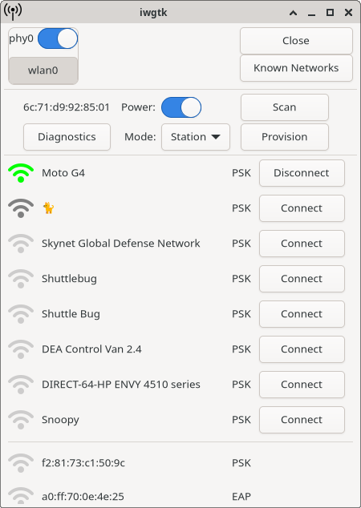

## About
iwgtk is a wireless networking GUI for Linux. It is a front-end for iwd, with
supported functionality similar to that of iwctl. Features include viewing and
connecting to available networks, managing known networks, provisioning new
networks via WPS or Wi-Fi Easy Connect, and an indicator (tray) icon displaying
connection status and signal strength.



## Usage
Launch the application window: `iwgtk`

Launch the indicator daemon: `iwgtk -i`

### Autostarting
The most common use case for iwgtk is to start the indicator daemon every time
you log into your desktop. If your desktop environment supports the XDG
autostart standard, this should happen automatically due to the
`iwgtk-indicator.desktop` file which is placed in `/etc/xdg/autostart/` during
installation.

A systemd unit file to start the indicator daemon is also provided. If your
distro uses systemd and your desktop environment supports systemd's
`graphical-session.target` unit, then iwgtk can be started at the beginning of
every desktop session by enabling the `iwgtk.service` unit.

### Configuration
Icon colors and other options can be customized by editing the application's
configuration file. The system-wide configuration file is located at
`$(sysconfdir)/iwgtk.conf`. `$(sysconfdir)` is usually either `/etc` or
`/usr/local/etc`, depending on your build-time `prefix` setting. `iwgtk.conf`
can be copied to `~/.config/iwgtk.conf` if desired, in which case the
system-wide configuration file will be ignored. For further instructions, please
see `man 5 iwgtk` and refer to the comments in `iwgtk.conf`.

## Dependencies

### Runtime dependencies
* iwd (>= 1.28)
* gtk4 (>= 4.6)
* libqrencode
* adwaita-icon-theme (or an equivalent icon package)

### Build dependencies
* meson (>= 0.60.0)
* scdoc

## Installation
To build iwgtk and install to `/usr/local`, run:
```
meson setup build
cd build
meson compile
sudo meson install
```

To install to `/usr` instead of `/usr/local`, replace `meson setup build` with:
```
meson setup --prefix=/usr build
```

## Troubleshooting

### The indicator icon doesn't show up
iwgtk's icon should show up on any system tray which supports the
StatusNotifierItem API. If your tray only supports the older XEmbed API, then a
compatibility layer such as [snixembed](https://git.sr.ht/~steef/snixembed) is
required.

The following trays support StatusNotifierItem:
* KDE Plasma
* swaybar
* xfce4-panel (*must be built with the optional libdbusmenu-gtk3 dependency*)

The following trays only support XEmbed, and require a compatibility layer:
* AwesomeWM
* i3bar

### iwgtk and iwctl only work with superuser privileges
As of iwd 1.23, membership in either the `netdev` or `wheel` group is required
to control iwd:
```
# usermod -a -G netdev YOUR_USER_ACCOUNT
```
If no `netdev` group exists on your system, then you'll need to create it prior
to running the above `usermod` command:
```
# groupadd netdev
```

## License
Copyright 2020-2022 Jesse Lentz <jesse@twosheds.org> and contributors (see below)

iwgtk is licensed under the GPL version 3 or later.

The application icon is from the [wifi
states](https://thenounproject.com/iconsguru/collection/wifi-states/) collection
by [i cons](https://thenounproject.com/iconsguru/) from the Noun Project. This
icon is licensed under the [Creative Commons BY
license](https://creativecommons.org/licenses/by/3.0/us/legalcode).

## Contributors
* Jove Yu
* Jaron Viëtor (Thulinma)
* tinywrkb
* Érico Nogueira Rolim
* VaguePenguin
* Andrew Benson
* Alex Piechowski (grepsedawk)
